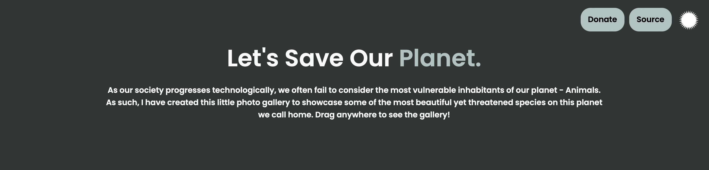
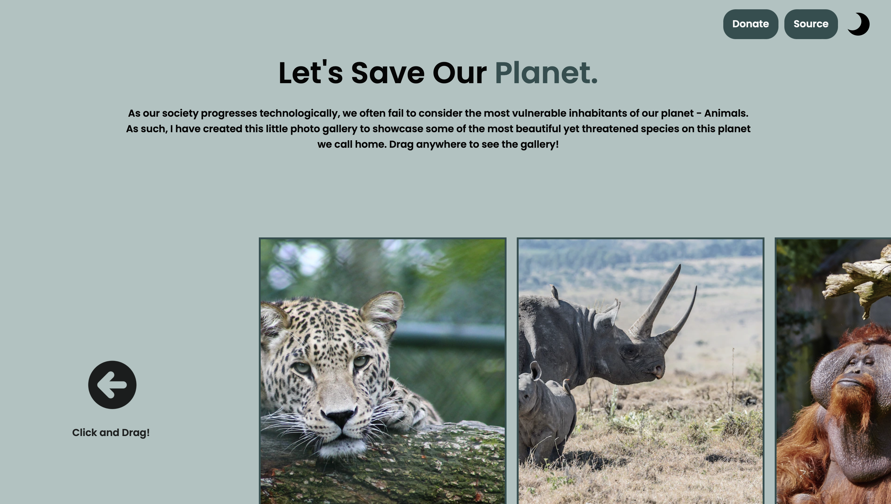

## Save the Planet!

This is a nature-themed parallax photo gallery that I've made to raise awareness for many of the unknown but critically endangered species on this beautiful planet! As we progress technologically, we often fail to consider the impacts of our actions on the fellow creatures with whom we share this planet. It is for this reason I have made this project.

In order to make this website, I used JavaScript with Svelte.js as a framework. To view the site in its full glory, I suggest running on a desktop window using Google Chrome. Please also feel free to visit [here](https://save-the-planet-mu.vercel.app). 

Some Photos: 

